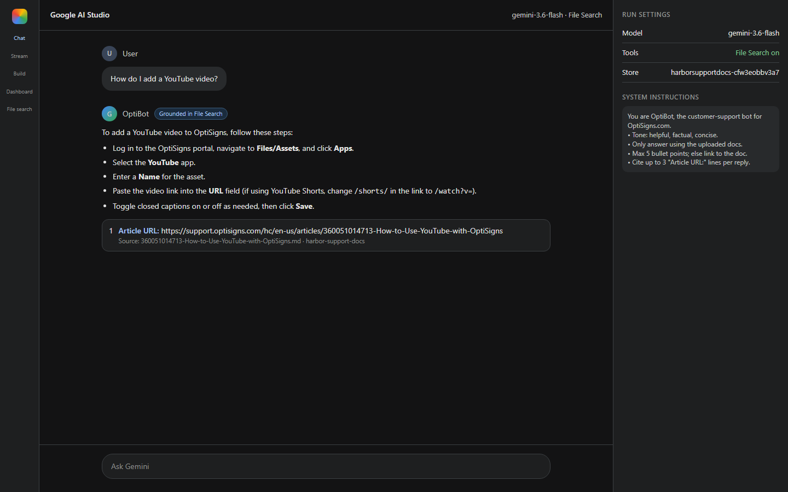

# Harbor KB

Help Center ingest: scrape → clean Markdown → Gemini File Search (API only).

## Setup

```powershell
python -m venv .venv
.\.venv\Scripts\python -m pip install -r requirements-dev.txt
copy .env.sample .env
```

Set `GEMINI_API_KEY` from [Google AI Studio](https://aistudio.google.com/apikey).

## Tests

No Gemini/Zendesk calls (scraper is mocked). From the repo root:

```powershell
.\.venv\Scripts\python -m pytest
.\.venv\Scripts\python -m pytest tests/test_convert.py
```

| File | Cases |
|---|---|
| `tests/test_convert.py` | Strip nav/scripts; keep ATX headings, `#` jumps, fenced code; `Article URL:` line; drop filename image alts and `data:` URIs |
| `tests/test_scraper.py` | Skip drafts/empty; paginate; fail below 30 articles on a full scrape; stop at `updated_at` watermark; space pages; retry HTTP 429 |
| `tests/test_catalog.py` | SHA-256 delta `added` / `updated` / `skipped` / `removed`; persist Gemini store id + watermark; skip rewrite when Markdown is unchanged; `--remove` lookup + local purge |
| `tests/test_report.py` | Compact run log: pending-upload slug, no dumped dict |
| `tests/test_ask.py` | Keep `Article URL:` cites, drop `Source:`; map Gemini file names / titles back to Help Center URLs |

## 0. Warm-up

Free Gemini key at [aistudio.google.com/apikey](https://aistudio.google.com/apikey).

## 1. Scrape ⇒ Markdown

Public Zendesk Help Center API, published articles only. Pages wait `SCRAPE_MIN_INTERVAL` (default 0.5s); HTTP 429 retries with `Retry-After`. HTML cleaned (nav/ads/scripts removed); headings, relative `#` links, and code blocks kept. Each file is `<slug>.md` with an `Article URL:` line.

```powershell
.\.venv\Scripts\python main.py --scrape-only
```

Output: `data/articles/` (409 files, ≥30 required).

## 2. Assistant + vector store (API upload)

Create the assistant in [AI Studio](https://aistudio.google.com) with this system prompt:

> You are a customer-support assistant for the uploaded Help Center docs.
> • Tone: helpful, factual, concise.
> • Only answer using the uploaded docs.
> • Max 5 bullet points; else link to the doc.
> • Cite up to 3 "Article URL:" lines per reply.

Enable **File Search**. Upload is API-only (no UI drag-and-drop):

```powershell
.\.venv\Scripts\python main.py
.\.venv\Scripts\python -m harbor.ask "How do I add a YouTube video?"
.\.venv\Scripts\python -m harbor.console
```

Local desk: [http://127.0.0.1:8765](http://127.0.0.1:8765) (`--repl` for a terminal prompt). Last-run counts: [http://127.0.0.1:8765/run](http://127.0.0.1:8765/run). On a VPS: `python3 -m harbor.console --host 0.0.0.0 --port 8765` then open `http://VPS_IP:8765/run`.

Attach the printed store id (`fileSearchStores/...`). **Chunking:** Gemini `white_space_config`, **512 tokens / 256 overlap** (API max is 512). Logs print file count and estimated chunks (~4 chars/token).

**Screenshot:** ask *How do I add a YouTube video?* in AI Studio; save citations as `docs/assistant-youtube.png`.



## 3. Daily job

`main.py` re-scrapes (stops at the last `updated_at` watermark unless `--full`), SHA-256 diffs, uploads added/updated files, deletes unpublished ones (`removed`), logs `added` / `updated` / `skipped` / `removed`, then exits 0.

```powershell
.\.venv\Scripts\python main.py --remove 360016247974
.\.venv\Scripts\python main.py --remove some-article-slug.md another-id
```

`--remove` takes an article id, slug, or `.md` filename. It drops the local file, the catalog row, and the File Search document. `--full` does the same for articles that disappeared from the Help Center. Incremental runs do not guess deletions (watermarked fetch is a prefix, not a full list).

Same image, two processes: the job **runs once and exits 0**; the desk stays on port 8765 and serves last-run counts.

```bash
docker build -t harbor-kb .
docker run --rm --env-file .env \
  -v "$PWD/data:/app/data" -v "$PWD/logs:/app/logs" \
  harbor-kb
```

Keep `/run` public without installing Python on the VPS:

```bash
docker compose up -d desk
docker compose run --rm job
```

- Desk: http://45.130.164.151:8765
- Last run: http://45.130.164.151:8765/run · http://45.130.164.151:8765/logs
- JSON: http://45.130.164.151:8765/last-run.json

Cron (06:00 UTC, after `docker build` / `compose up -d desk`):

```cron
0 6 * * * cd /root/optisign/harbor_agent && /usr/bin/docker compose run --rm job >> /root/optisign/harbor_agent/logs/cron.log 2>&1
```

Also scheduled on GitHub: `.github/workflows/daily.yml` (06:00 UTC + `workflow_dispatch`).

**Job logs:** [Actions — daily-sync](https://github.com/bachle0212/harbor_agent/actions/workflows/daily.yml) · VPS last run: [http://45.130.164.151:8765/run](http://45.130.164.151:8765/run) · artefact: [`logs/last-run.json`](logs/last-run.json)
